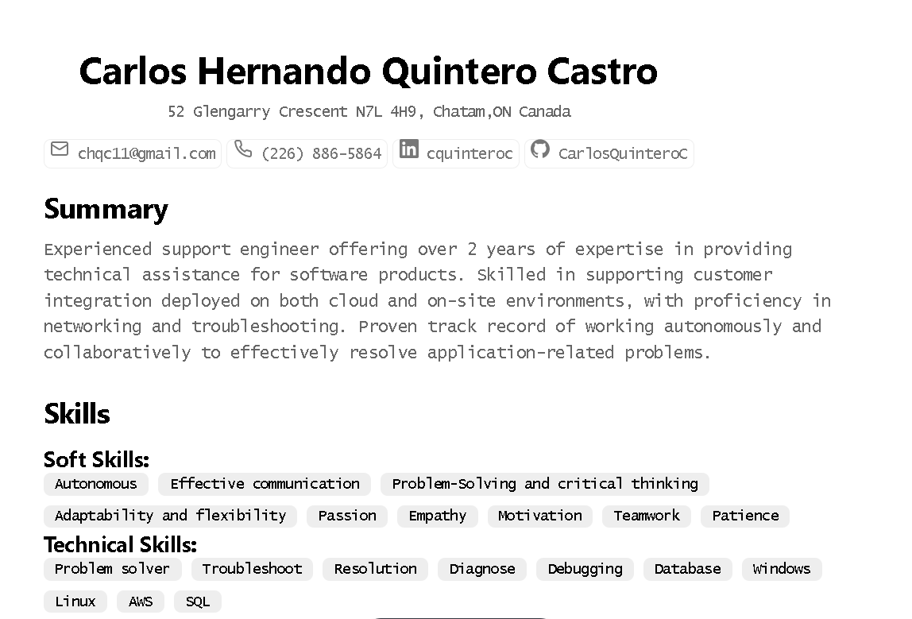

# Static Portfolio or Resume

Es un proyecto sencillo en el que se usa el framework Astro debido a su facilidad para crear sitios web estáticos.

El sitio creado es una pagina que se maquetado para tener el esquema de un Resume al estilo canadiense.

Quien desee utilizar este proyecto como plantilla para generar su propio resume, debe tener en cuenta que solo con editar el archivo cv.json con su propia información será suficiente para adaptarlo a sus necesidades.

## Comandos AStro disponibles : 

| Command                   | Action                                           |
| :------------------------ | :----------------------------------------------- |
| `npm install`             | Installs dependencies                            |
| `npm run dev`             | Starts local dev server at `localhost:4321`      |
| `npm run build`           | Build your production site to `./dist/`          |
| `npm run preview`         | Preview your build locally, before deploying     |

### 
Créditos: Este proyecto ha sido creado a partir del proyecto minimalist-portfolio del creador de contenido Midudev.
